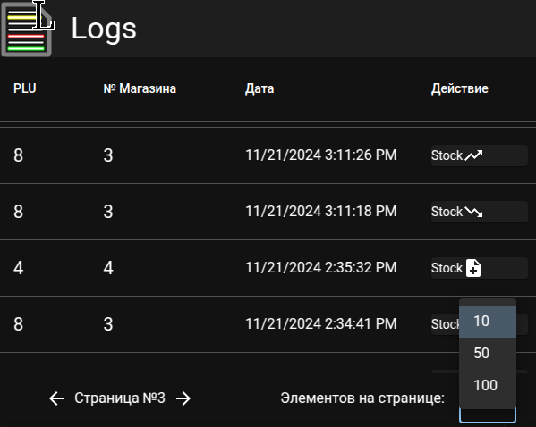
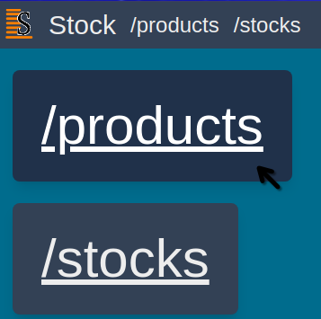
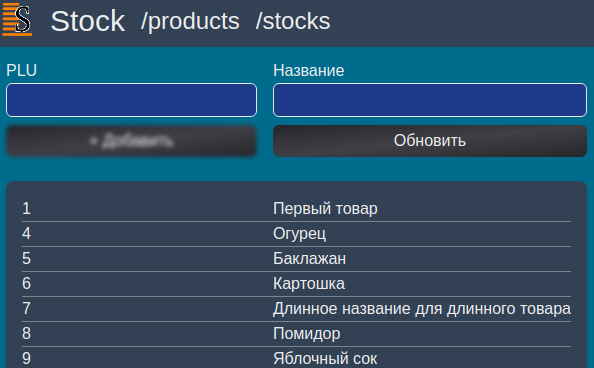
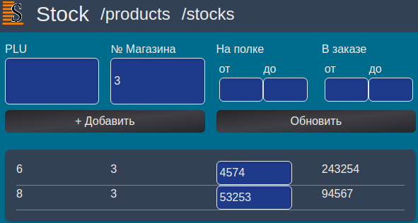

# About
This is a monorepo containing two [Next.js](https://nextjs.org/) projects: service-product-log and service-product-stock (They had to be separate by the customer request).
They share a single PostgreSQL database [Prisma ORM](https://www.prisma.io/) is used to communicate with. You can find the schema at /shared/db. Both services use [Zod](https://zod.dev/) for back-end data validation.

### Product log service


A simple single-page JavaScript (not TS by customer request) project that uses [Material UI](https://mui.com/). Provides a table to view the log of actions created by the ↙️

### Product stock service



Product registry



Product stock in shops



A TypeScript project to manage a hypothetical industry's stock, as well as to view product registry. Uses [Tailwind](https://tailwindcss.com/) and plain HTML for UI. While the front-end is not the prettiest (mainly because [I](https://github.com/IlyaBoykoAtWork) am not a designer, but a programmer), the project uses custom type-safe abstractions for API routes (a mimic of [tRPC](https://trpc.io/)).

## How to run a service

```sh
cd <service name>
npm i
 export DATABASE_URL=postgresql://<username>:<password>@<TCP address>/<database name>
npm run prisma
npm run build
npm run start
```

Note: *This project is a monorepo. Ignore false positives such as "Found lockfile missing swc dependencies". This is an issue in Next.js.*